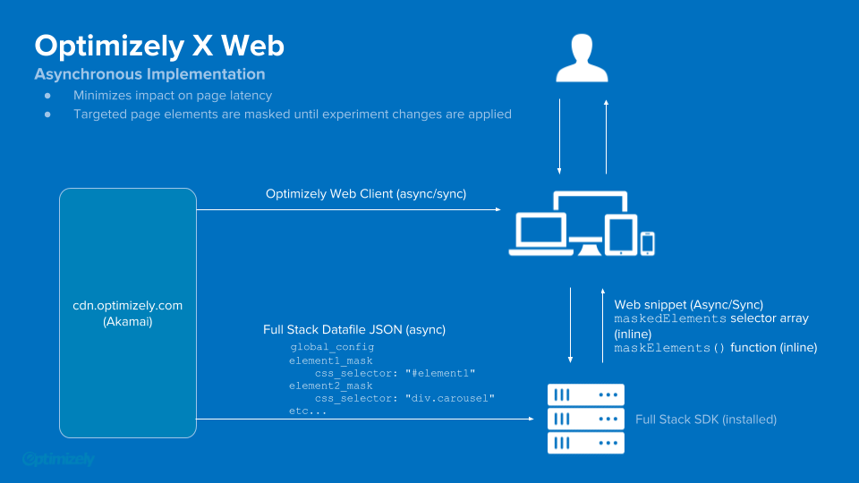
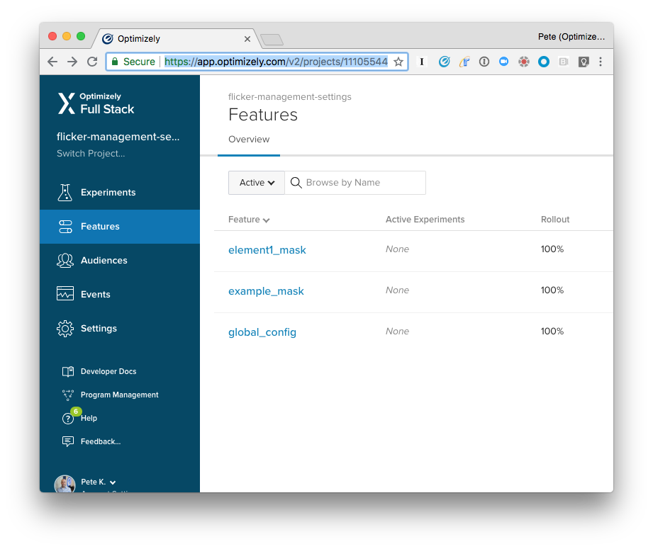
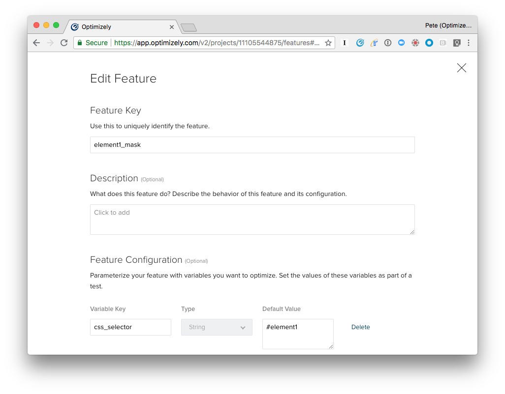
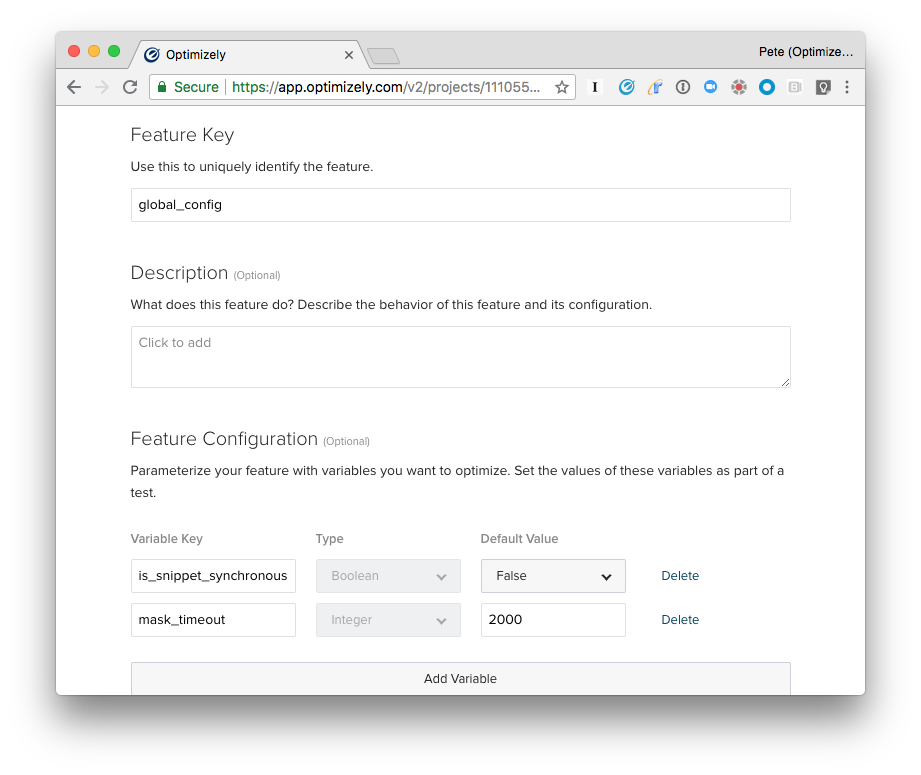

# Flicker Management Example App

This application illustrates a simple flicker management mechanism for asynchronous installs of Optimizely X Web.  The mechanism works by masking certain elements until all syncronous Optimizely variation code has been executed, preventing the "flicker" of original content as the page is loading.

* The application uses Cooper Reid's [client-side masking code](https://github.com/optimizely/addons-library/tree/master/nonblocking-snippet) to hide certain DOM elements until Web experiment changes are applied.
* The app loads an [X Web client](https://cdn.optimizely.com/js/11085868647.js) with a one-variation experiment that modifies the contents of "Element 1" and "Element 2".
* The X Web client's loading delay is deliberatly exaggerated in order to illustrate the impact of masking the modified element.
* A [Mask Configuration Full Stack project](https://cdn.optimizely.com/json/11105544875.json) is used to dynamically configure which elements on the site are masked. 
* The same Full Stack project may be used to load the snippet synchronously instead of asynchronously, which will also eliminate flicker at the cost of increased page latency. 

## Architecture

See [this presentation](https://docs.google.com/presentation/d/1s8VX9djBmsy3AwZpcRJuj33LCOXIJdk7XWE20aZbtug/edit#slide=id.g3e66b76d14_0_0) for more detail.

## Deploying the application

1. Create and run a [virtualenv](http://docs.python-guide.org/en/latest/dev/virtualenvs/)
2. Install requirements: `pip install -r requirements.txt`
3. Run the application `python application.py` (be sure the virtualenv is running)
4. You’re all set. To try this with your own Optimizely projects, modify `FULL_STACK_PROJECT_ID` and `WEB_PROJECT_ID` in `application.py`.

To see the masking in action, load

      http://localhost:4001/

in a web browser.  To view the page without masking enabled, load

      http://localhost:4001/?disablemask

## How it works

There is nothing special about the X Web experiment running in this appliction.  It executes a small custom JavaScript change to the two colored elements on the page.

The python appserver renders the contents of `mask.js` into the head of the `index.html` template.  `mask.js`defines a function, `hideElements()`, which is called on a list of css selectors.  We use [Features](https://help.optimizely.com/Set_Up_Optimizely/Develop_a_product_or_feature_with_Feature_Management) in a "mask configuration" [Full Stack project](https://cdn.optimizely.com/json/11105544875.json) to populate this list.  To mask an additional element, the user need only 

1. create a new Feature in this project, e.g. `example_mask`
2. add a String `css_selector` variable to the `example_mask` feature config
3. set the default value of this variable to the appropriate css selector, e.g. `#exampleElement`

`mask.js` will mask all elements corresponding to the `css_selector` variable values for all active features. The user can use the appropriate [Feature Toggle](https://help.optimizely.com/Set_Up_Optimizely/Develop_a_product_or_feature_with_Feature_Management) to enable or disable masking for any element.  The user could even target element masking to a specific audience!

## The Mask Configuration Full Stack Project

Here's a rough schema for the features defined in the "mask configuration" [Full Stack project](https://cdn.optimizely.com/json/11105544875.json):

      global_config
        is_snippet_synchronous: True
        mask_timout: 2000

      element1_mask
        css_selector: "#element1"

      element2_mask
        css_selector: "div.carousel"

      etc.

